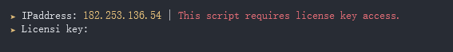
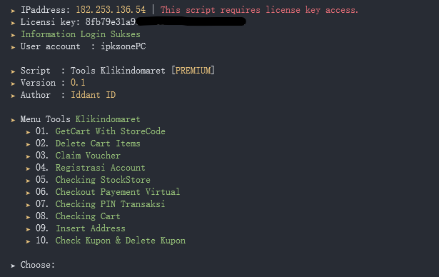

View tools klikindomaret
<center></center>
<center></center>

Fiture tools klikindomaret
- [x] Auto masukan keranjang items dengan kode toko
- [x] Auto delete keranjang items
- [x] Auto claim kode vocher
- [x] Registrasi akun with auto verifikasi PIN dengan TMail
- [x] Auto check stok di toko
- [x] Auto checkout pembayaran virtual
- [x] Auto check PIN transaksi 
- [x] Auto check keranjang items
- [x] Auto add data address ( berlaku jika akun kalian kosong data alamat nya )
- [x] Auto check vocher & auto delete vocher


Installations tools indomaret command in 
```
$ git clone https://github.com/ipkzone/klikindomaret_tools
$ cd /klikindomaret_tools
$ php run.php --indomaret
```
Step installations Installer
> Untuk cek php anda versi berapa ketikan command di bawah ini.
```shell
$ php -v
```


> Response<br>
> PHP 7.4.27 (cli) (built: Dec 14 2021 19:52:13) ( ZTS Visual C++ 2017 x64 )
Copyright (c) The PHP Group<br>
> Berarti Versi PHP kamu versi 7<br>
> Step selanjutnya kamu tinggal cek karnel HP kamu ketikan command di bawah ini.


```shell
$ uname -a
```
> Response<br>
> Linux localhost 4.9.227-perf+ #1 SMP PREEMPT Thu May 5 15:46:07 CST 2022 <font color="green">aarch64</font> Android<br>
> Berarti karnel kamu adalah (aarch64)<br>
> Lalu jalankan installer anda ikuti command di bawah ini.

```
$ git clone https://github.com/ipkzone/klikindomaret_tools
$ cd /klikindomaret_tools
$ cd /installer
$ php installer.php --aarch64_php7
```
Keterangan
> --armv7_php7 ( Untuk PHP versi 7 dengan karnel armv7 )<br>
> --aarch64_php7 ( Untuk PHP versi 7 dengan karnel aarch64 )<br>
> --armv7_php8 ( Untuk PHP versi 8 dengan karnel armv7 )<br>
> --aarch64_php8 ( Untuk PHP versi 8 dengan karnel aarch64 )<br>


Contact admin for [Order Script](https://api.whatsapp.com/send?phone=62895375136311&text=Hallo%20mau%20order%20script%20klikindomaret%20bos).<br>

# Note
The script runs with the license key,
if you don't have a license key then you can't run it,
to get a license key you have to ask the creator for its activation for a donation of course,
This script blocks multiple user logins so that the script remains safe and secure.

Regards,
**Iddant ID**
